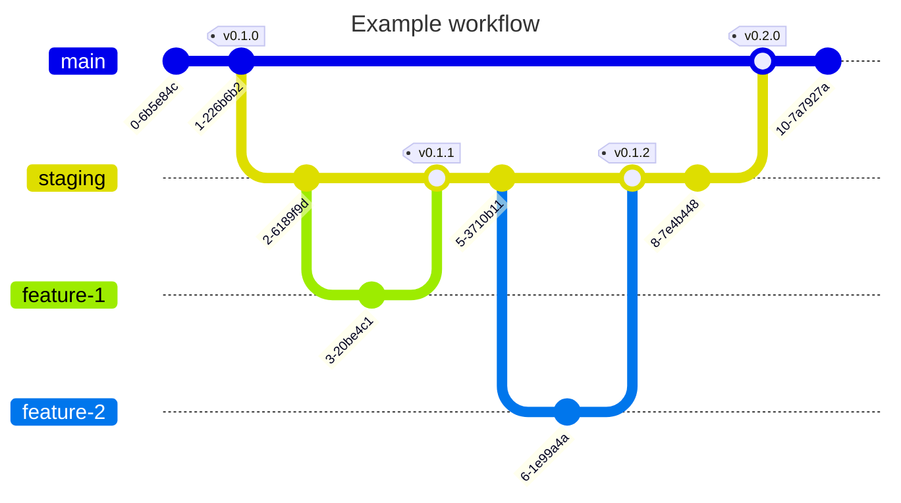

# Personal Website

Hi, this is my personal website! I'm currently between classical web development
with html, css, and javascript and modern web development with Next.js and
React.

## Tech Stack

- `nix` to setup the [development machine](#developer-workflow)
- [Next.js](https://nextjs.org) for the [React](https://react.dev) framework
- [tailwindcss](https://tailwindcss.com)
  - [headless ui](https://headlessui.com/) as a complimentary `tailwindcss` UI
    library
- [pnpm](https://pnpm.io) for the package manager
  - [eslint](https://eslint.org) for the `js[x]` and `ts[x]` linter
  - [prettier](https://prettier.io) for the general formatter
  - [font awesome icons](https://fontawesome.com) which are
    [set up for React and Next.js](https://docs.fontawesome.com/web/use-with/react)
- Deploying (currently) on [Vercel](https://vercel.com) at
  [sua.sh](https://sua.sh)

## Project Workflow

Currently, I have the production website at [sua.sh](https://sua.sh) and the
preview website at [sua-dev.vercel.app](https://sua-dev.vercel.app). The
production website is tied directly to
[main](https://github.com/suasuasuasuasua/personal-website/tree/main), while the
preview website is tied to
[staging](https://github.com/suasuasuasuasua/personal-website/tree/staging).

I'm drafting small issues and pull requests that merge into the staging branch.
When I've made significant enough progress, I'll merge back staging into main.



TLDR; go to [sua-dev.vercel.app](https://sua-dev.vercel.app) for the latest
changes, but you will need to sign into [Vercel](https://vercel.com). Or, go to
the [staging](https://github.com/suasuasuasuasua/personal-website/tree/staging)
branch, pull the changes, and run `pnpm dev` to start up a local development web
server.

## Developer Workflow

### Installation

Install `nix` from
[Determinate Systems](https://determinate.systems/posts/determinate-nix-installer/).

```bash
curl --proto '=https' --tlsv1.2 -sSf -L \
     https://install.determinate.systems/nix | sh -s -- install
```

Use [`devenv`](https://devenv.sh) and [`direnv`](https://direnv.net) to install
and load the developer shell with all the tooling built in.

I recommend using [`neovim`](https://neovim.io) or
[`vscode`](https://code.visualstudio.com) with the
[devcontainer extension](https://marketplace.visualstudio.com/items?itemName=ms-vscode-remote.remote-containers)
for the text editor.

### Run the Server

Run `pnpm dev` to start up the local development web server.

Alternatively, use `vercel dev` and sign in to start the same server but gain
the ability to interact with Vercel data.

### Contribution

When committing, use
[commitizen](https://commitizen-tools.github.io/commitizen/) to format the
commit title and subtext to ensure
[conventional commits](https://www.conventionalcommits.org/en/v1.0.0/).

There are also a number of commit hooks set up for
[pre-commit](https://pre-commit.com) to ensure consistent formatting and style.
